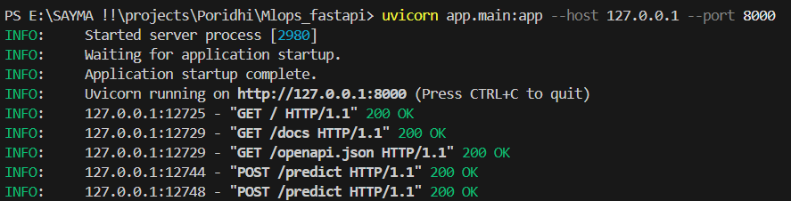
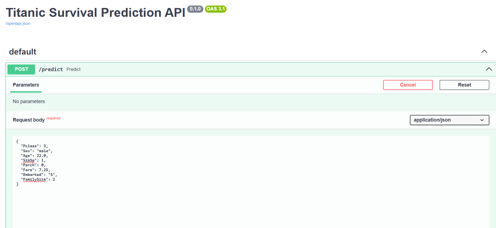
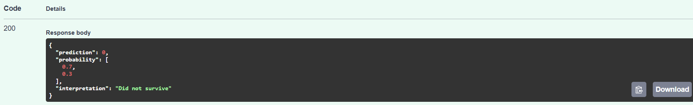
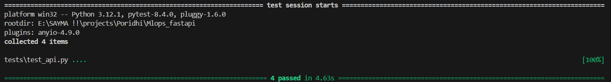
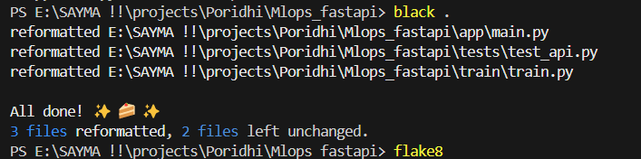
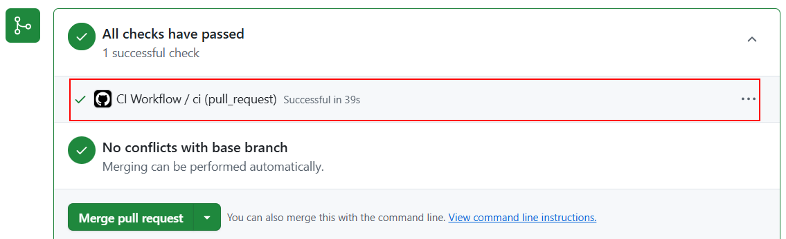
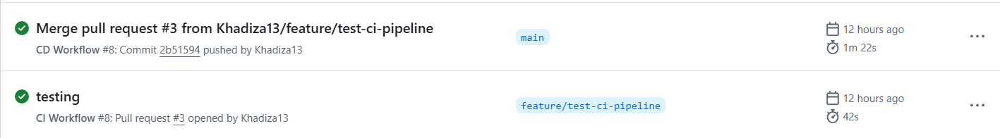

# MLOps FastAPI PoC – Titanic Dataset

### 📌 Overview

A complete MLOps implementation for predicting Titanic passenger survival using machine learning, featuring automated CI/CD pipelines, containerization, and comprehensive testing.

### Overall Architecture


## 📁 Project Structure

```
mlops_fastapi_poc/
├── app/
│   └── main.py
├── tests/
│   ├── test_api.py
│   └── test_data_quality.py
├── data/
│   ├── raw/
│   │   └── train.csv
│   ├── processed/
│   │   └── train_processed.csv
│   └── model.pkl
├── .github/
│   └── workflows/
│       ├── ci.yml
│       ├── cd.yml
│       └── retrain.yml
├── train.py
├── Dockerfile
├── docker-compose.yml
├── requirements.txt
└── README.md
```

## 🛠️ Technology Stack

- **Backend**: Python 3.11, FastAPI, Uvicorn
- **ML Framework**: scikit-learn, pandas, joblib
- **Data Validation**: Great Expectations
- **Testing**: pytest, FastAPI TestClient
- **Code Quality**: black, flake8
- **Containerization**: Docker, Docker Compose
- **CI/CD**: GitHub Actions
- **Container Registry**: GitHub Container Registry (GHCR)

## Model Development & Training


### 🧪 Dataset & EDA

- Dataset: [Titanic - Machine Learning from Disaster](https://www.kaggle.com/c/titanic/data)
- EDA adapted from: [Data Science Solutions](https://www.kaggle.com/code/startupsci/titanic-data-science-solutions)

## 📊 Model Details

### Model Performance

- **Algorithm**: Random Forest Classifier
- **Estimators**: 100 trees
- **Validation**: 80/20 train-test split
- **Evaluation**: Accuracy score and probability predictions

### 🛠 How to Run

```bash
# Install deps
pip install -r requirements.txt

# Train model
python train/train.py

# Run API
uvicorn app.main:app --reload
```

### Access the API

- API Documentation: http://localhost:5000/docs
- Health Check: http://localhost:5000/

### Docker Deployment

1. **Build and run with Docker Compose**

   ```bash
   docker-compose up -d
   ```

2. **Check service status**
   ```bash
   docker-compose ps
   ```

## 📡 API Usage



## Prediction




## 🧪 Testing

### Run All Tests

```bash
pytest tests/
```



### Code Quality Checks

```bash
# Linting
flake8

# Format checking
black .
```



## 🔄 CI/CD Pipelines


### Continuous Integration (CI)

Triggered on pull requests to `main`:

- Code linting and formatting checks
- Unit and integration tests
- Data quality validation
- Docker image building



### Continuous Deployment (CD)

Triggered on pushes to `main`:

- Full test suite execution
- Docker image build and push to GHCR
- Automated deployment using Docker Compose
- Health checks and rollback capabilities



### Automated Retraining

Scheduled weekly (Mondays at 3:00 AM UTC):

- Model retraining
- Automated model updates
- Git commit and push of new model

### Self-Hosted Runner Setup

To use self-hosted runners:

1. Set up a runner in your GitHub repository (Settings > Actions > Runners > New self-hosted runner).
2. Install dependencies: Docker, Python 3.11, and `requirements.txt`.
3. Assign the `self-hosted` label to the runner.
4. Ensure the runner has access to the GHCR token stored in GitHub Secrets.

### GHCR Configuration

To authenticate with GHCR:

1. Create a Personal Access Token (PAT) with `packages:read` and `packages:write` scopes.
2. Store the PAT as a GitHub Secret named `GHCR_TOKEN`.
3. Workflow files use this secret to log in to GHCR and push/pull images.

## 🔧 Configuration

### Environment Variables

- `IMAGE_NAME`: Docker image name for deployment
- `PYTHONPATH`: Python module path
- `PYTHONUNBUFFERED`: Ensures real-time log output

### Port Configuration

- Default API port: `5000`
- Health check endpoint: `/health`
- API documentation: `/docs`

## 📈 Monitoring and Logging

- **Health Checks**: Built-in Docker health monitoring
- **API Logs**: Structured logging with timestamps
- **Error Handling**: Comprehensive exception handling with detailed error messages
- **Metrics**: Request/response logging for performance monitoring

## 📋 Development Workflow

1. **Local Development**: Use virtual environment and run tests locally
2. **Code Quality**: Ensure all code passes linting and formatting checks
3. **Testing**: Write tests for new features and maintain coverage
4. **Pull Request**: Submit PR which triggers CI pipeline
5. **Review & Merge**: Code review and merge to main triggers CD pipeline
6. **Monitoring**: Monitor deployed application health and performance

✅ From model training to deployment — a complete MLOps pipeline with FastAPI and GitHub Actions.
